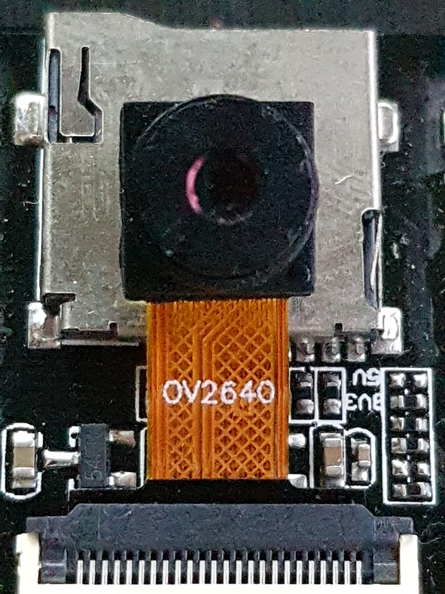
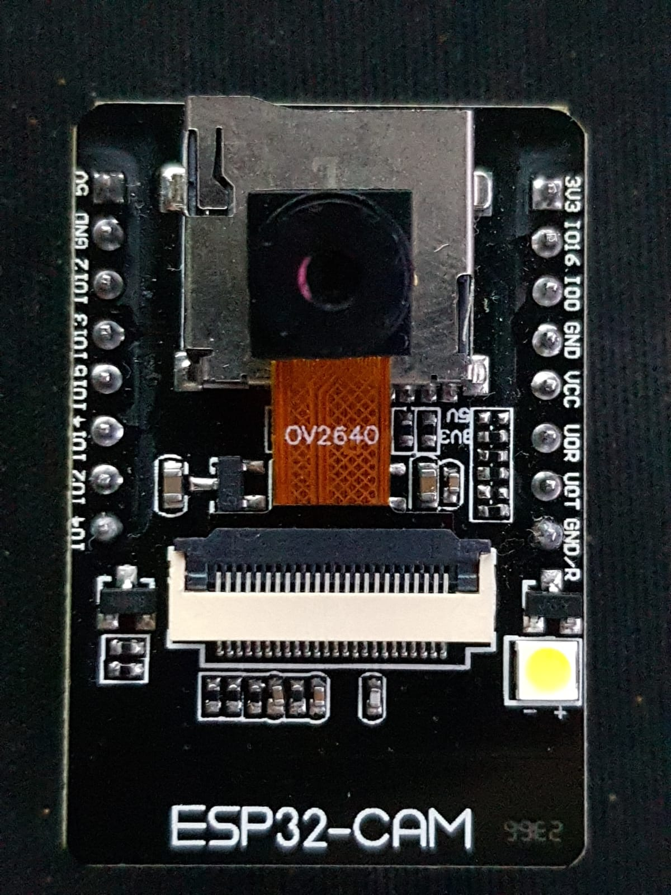
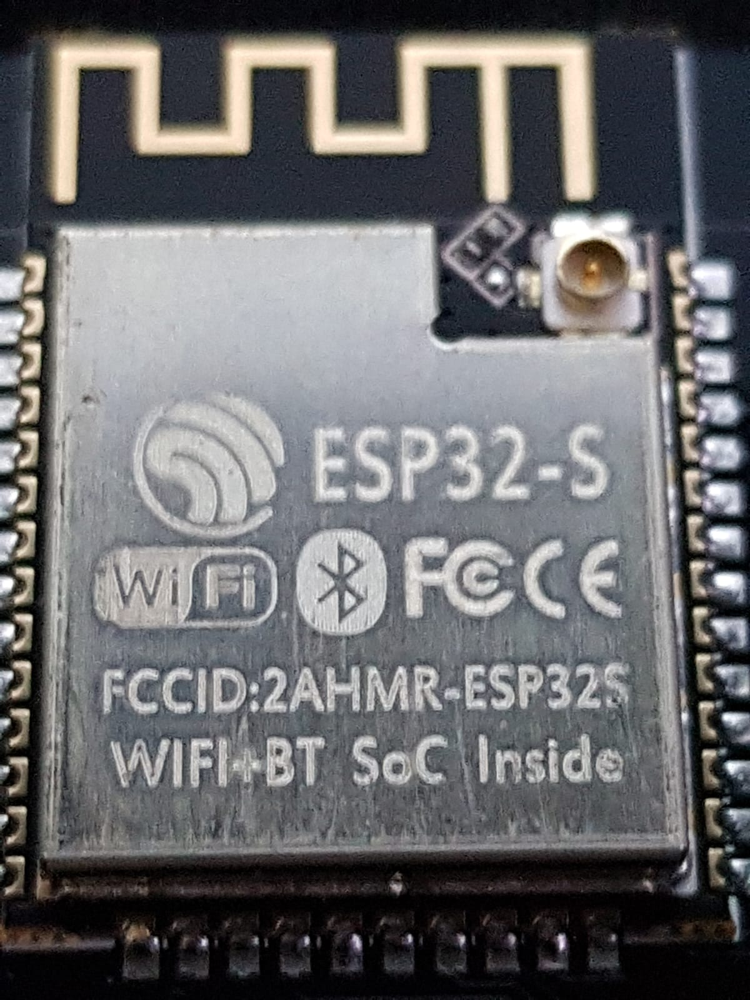
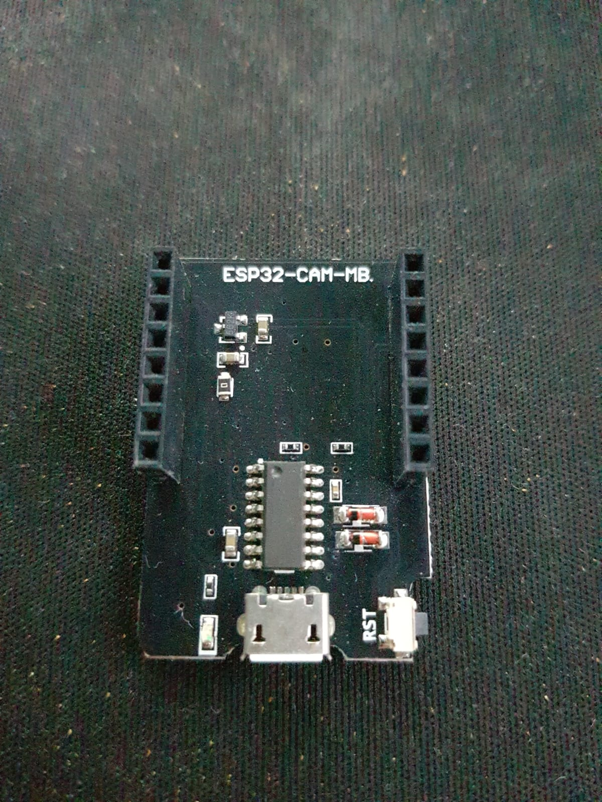

# ESP32CAM Cifar10 Project But Used Two Images, Dog and Cat

- After training model on edge impulse run this code for including library to platformio: `~/.platformio/penv/bin/pio lib install lib/cifar10_final-v3.zip`

## Used embedded device parts:

